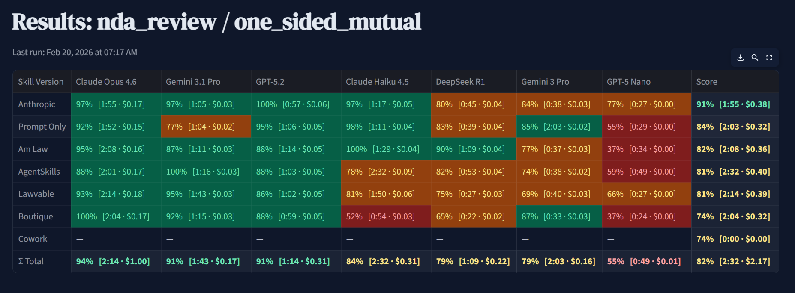

# Skillcheck

**An evaluation harness that measures which AI "skills" actually perform best on legal document analysis.**

Skills — structured prompts that tell AI models how to do a specific job — are proliferating across the legal AI ecosystem. Anthropic ships them, indie developers publish them, startups sell them. But which ones actually work? Does a 2,500-token methodology outperform a 130-word sticky note? Does either beat a bare prompt?

Skillcheck answers these questions with data. Pick a task, pick your models, pick your skills, and run a controlled bake-off against an expert answer key.



---

## What It Does

Skillcheck runs AI models through legal document review tasks with different skills and scores the results against expert-graded answer keys. Every prompt is a skill — from a bare "review this NDA" to a 2,500-token methodology built on academic benchmarks. It measures:

- **Issue detection** — Did the model find what a senior attorney would find?
- **Skill comparison** — Which skill produces the best work product on which model?
- **Model comparison** — How do frontier, mid-tier, and open-source models stack up on the same task with the same playbook?
- **LLM-as-judge scoring** — Optionally, a judge model evaluates response quality across rubric dimensions (identification, characterization, severity, actionability)

The first skill is **NDA Review**: a deliberately one-sided "mutual" NDA with 16 planted issues across three severity tiers. More skills can be added without code changes.

## Quick Start

**Prerequisites:** Python 3.12+ and at least one LLM API key.

```bash
git clone https://github.com/robsaccone/skillcheck.git
cd skillcheck

# Create a virtual environment
python -m venv .venv

# Activate it
# macOS/Linux:
source .venv/bin/activate
# Windows:
.venv\Scripts\activate

# Install dependencies
pip install -r requirements.txt

# Add your API keys (any subset works — models without keys are skipped)
cp .env.example .env
# Edit .env with your keys

# Launch the dashboard
streamlit run app.py
```

The dashboard opens at `http://localhost:8501`. Models without API keys are grayed out but the app still works with whichever providers you have configured.

## Supported Models


| Model            | Provider  | API Key             |
| ---------------- | --------- | ------------------- |
| Claude Opus 4.6  | Anthropic | `ANTHROPIC_API_KEY` |
| Claude Haiku 4.5 | Anthropic | `ANTHROPIC_API_KEY` |
| GPT-5.2          | OpenAI    | `OPENAI_API_KEY`    |
| GPT-5 Nano       | OpenAI    | `OPENAI_API_KEY`    |
| Gemini 3 Pro     | Google    | `GOOGLE_API_KEY`    |
| Gemini 3.1 Pro   | Google    | `GOOGLE_API_KEY`    |
| Gemini 3 Flash   | Google    | `GOOGLE_API_KEY`    |
| DeepSeek V3.1    | Together  | `TOGETHER_API_KEY`  |
| DeepSeek R1      | Together  | `TOGETHER_API_KEY`  |
| Qwen3 235B       | Together  | `TOGETHER_API_KEY`  |


Model configurations are stored in [`models.json`](models.json). New models can be added by adding an entry there — any provider with an OpenAI-compatible API can use the Together pattern. Each entry needs: `provider`, `model_id`, `display_name`, `env_key`, `cost_in`, `cost_out`, `context_k`, and `temperature`.

## Included Skills

Skills are organized by task type, with one file per source:


| Skill                       | Source                                                            | Tokens | License    |
| --------------------------- | ----------------------------------------------------------------- | ------ | ---------- |
| `nda_review/baseline`       | Skillcheck                                                        | ~20    | MIT        |
| `nda_review/lawvable`       | [Lawvable](https://github.com/lawvable/awesome-legal-skills)      | ~170   | AGPL-3.0   |
| `nda_review/evolsb`         | [evolsb](https://github.com/evolsb/claude-legal-skill)            | ~2,500 | MIT        |
| `nda_review/skala`          | [Skala](https://www.skala.io/legal-skills)                        | ~800   | See source |
| `nda_review/custom`         | Skillcheck                                                        | ~1,200 | MIT        |
| `nda_triage/anthropic`      | [Anthropic](https://github.com/anthropics/knowledge-work-plugins) | ~480   | Apache-2.0 |
| `contract_review/anthropic` | [Anthropic](https://github.com/anthropics/knowledge-work-plugins) | ~600   | Apache-2.0 |
| `contract_review/evolsb`    | [evolsb](https://github.com/evolsb/claude-legal-skill)            | ~2,500 | MIT        |


## The Dashboard

Skillcheck ships as a Streamlit app with six pages:

**About** — Project overview and quick-start guide.

**Skills** — Browse all available skills with version counts, test documents, and answer keys. View issue details with severity badges.

**Models** — Overview of all configured models with provider, context window, pricing, and API key status.

**Judges** — Select one or two LLM judges for rubric-based evaluation. Configure multi-judge panels for more reliable scoring via majority vote. Customize the judge system prompt or use the default. Warns when judge and eval model share a provider (self-enhancement bias risk).

**Evaluate** — The main workspace. Select models, a skill, and a test document. Run evaluations with optional LLM-as-judge scoring. View results in a scored matrix with drill-down to individual responses, per-issue detection heatmaps, and per-issue reasoning from the judge.

**Chat** — Chat with evaluation data. Ask questions about results, consensus patterns, and model performance using an LLM with full context of your evaluation runs.

## How Scoring Works

### Quick Scoring (Keyword-Based)

Each test document has an expert answer key with issues classified into three tiers:


| Tier              | Weight | Standard                                    |
| ----------------- | ------ | ------------------------------------------- |
| **Must-catch**    | 3x     | Miss these and you've committed malpractice |
| **Should-catch**  | 2x     | A competent reviewer finds these            |
| **Nice-to-catch** | 1x     | Senior associates and partners catch these  |


Quick scoring uses keyword detection from the answer key. It's conservative — it can miss a valid detection but rarely produces false positives.

### LLM-as-Judge Scoring

When enabled, a judge model evaluates each response against the answer key using research-backed techniques:

- **Chain-of-thought reasoning** ([G-Eval](https://arxiv.org/abs/2303.16634)) — the judge reasons step-by-step before scoring each issue, improving alignment with human judgments
- **Binary per-issue detection** — strict 0/1 scoring with calibration examples, following best practices for reproducible evaluation ([Husain 2024](https://hamel.dev/blog/posts/llm-judge/))
- **Anti-verbosity instruction** — prevents inflated scores for longer responses ([Zheng et al. 2024](https://arxiv.org/abs/2306.05685))
- **Multi-judge panels** ([PoLL](https://arxiv.org/abs/2404.18796)) — run two judges from different model families in parallel, aggregate via majority vote for more reliable scoring
- **Self-enhancement bias detection** — warns when the judge and evaluated model share a provider, which can inflate scores ([Wataoka et al. 2024](https://arxiv.org/abs/2410.21819))

For details on the research behind these techniques and future directions, see [`docs/judging-research.md`](docs/judging-research.md).

## Project Structure

```
skillcheck/
├── app.py                          # Streamlit entry point
├── config.py                       # Path constants, scoring weights
├── models.json                     # Model configurations (provider, pricing, context)
├── models.py                       # Model loading and API dispatch
├── engine.py                       # Evaluation engine, scoring, result I/O
├── judge.py                        # LLM-as-judge scoring
├── consensus.py                    # Cross-model consensus analysis
├── streaming.py                    # Provider-specific streaming generators
├── components.py                   # Shared UI helpers
├── app.css                         # Custom styling
├── requirements.txt
├── .env.example
│
├── docs/                           # Research and reference documentation
│   └── judging-research.md         # LLM-as-Judge research notes and citations
│
├── pages/                          # Streamlit pages
│   ├── home.py
│   ├── skills.py
│   ├── skill_detail.py
│   ├── models.py
│   ├── judges.py
│   ├── evaluate.py
│   ├── chat.py
│   ├── result_detail.py
│   └── test_detail.py
│
├── skills/                         # Skill definitions (filesystem-based)
│   └── {skill_id}/
│       ├── skill.json              # Metadata, system prompt, user template
│       ├── *.skill.md              # One file per skill version
│       └── tests/
│           ├── *.md                # Test documents
│           └── *.json              # Expert answer keys with rubrics
│
└── results/                        # Generated evaluation results (gitignored)
    └── {skill_id}/{version}/{model}__{doc}.json
```

## Adding Your Own Skills

1. Create a directory under `skills/` with a `skill.json` containing `skill_id`, `display_name`, `system_prompt_prefix`, and `user_prompt_template`
2. Add `.skill.md` files for each version/variant
3. Add test documents (`.md`) and answer keys (`.json`) to `tests/`
4. Restart the app — your skill appears automatically

See the existing `skills/nda_review/` for a complete example.

## Background

This project grew out of an analysis of the emerging legal AI skills ecosystem — comparing catalogs from [Lawvable](https://github.com/lawvable/awesome-legal-skills), [Anthropic](https://github.com/anthropics/knowledge-work-plugins), [AgentSkills.legal](https://agentskills.legal), and others. The evaluation harness was built to answer a simple question: when multiple skills claim to improve AI performance on the same legal task, which one actually produces the best work product?

## Contributing

Contributions welcome — especially new skills, test documents, and answer keys. See [`CONTRIBUTING.md`](CONTRIBUTING.md) for setup instructions, code style, and guidelines.

If you build a skill, please open a PR. If you find issues with the scoring methodology or answer keys, file an issue.

## Disclaimer

This project is a research and evaluation tool — not a legal product. Nothing in this repository constitutes legal advice, and no output from any model or skill should be relied upon for legal decision-making. The test documents, answer keys, and scoring methodology are provided for demonstration and benchmarking purposes only. Always consult a qualified attorney for actual legal work.

## License

MIT — see [LICENSE](LICENSE).

Skills included in this repo retain their original licenses as noted in the skill files. The evaluation harness, test documents, answer keys, and custom skills are MIT licensed.

## Author

**Rob Saccone** · [NexLaw Partners](https://nexlawpartners.com) · [@robsaccone](https://github.com/robsaccone)

25+ years in legal technology. Previously CTO/co-founder at Lega, founder of XMLAW (acquired by Thomson Reuters), CEO of SeyfarthLean Consulting.